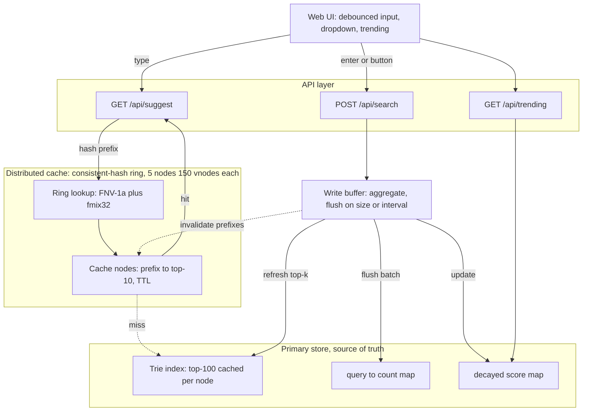

# Search Typeahead System

A low-latency search typeahead service: prefix suggestions ranked by popularity, recency-aware trending, a distributed cache partitioned by consistent hashing, and batched writes that absorb search-count update pressure. Built with Next.js and TypeScript, in-process and runnable with one command.

The design rationale, alternatives, and trade-offs for every component are in [PRD_search_typeahead.md](./PRD_search_typeahead.md), which also contains a viva quick-reference. Measured performance is in [PERFORMANCE.md](./PERFORMANCE.md).

## Architecture



Three layers:

- **Cache layer.** Five logical cache nodes, each holding `prefix -> top-10 suggestions` with a TTL. A prefix is owned by exactly one node, chosen by a consistent-hash ring with virtual nodes. The suggestion read path checks this layer first.
- **Primary store.** A `query -> count` map (source of truth) plus a trie index where each node caches its top-100 completions by count. Queried only on a cache miss.
- **Write path.** Search submissions land in an in-memory buffer, are aggregated, and flush to the store in batches on a size threshold or a time interval, whichever fires first.

Read path: normalize the prefix, hash it to its owning cache node, return the cached top-10 on a hit, or query the trie on a miss and repopulate the node with a TTL. Write path: enqueue the query and return immediately; a background flusher aggregates duplicates, applies the batch to the store and trending scores, and invalidates the affected prefix cache entries.

## Setup

Requires Node 18.17 or later.

```bash
npm install
npm run build
npm start
# open http://localhost:3000
```

For development with hot reload: `npm run dev`.

## Dataset

The store is built at startup from a synthetic dataset generated in `src/lib/dataset.ts`: 214,816 unique queries via combinatorial cross-products of brand, product, qualifier, tech, and place terms plus a specific-products list, with counts assigned on a Zipfian distribution (exponent 0.9) so popularity mirrors real search traffic. A handful of queries carry very high counts and roughly 92% sit in the long tail with a count of 1. No external file is required.

To use a real dataset instead, create `data/queries.tsv` with one `query<TAB>count` per line and replace `generateDataset()` with a file reader:

```ts
import fs from 'fs';
export function generateDataset(): QueryEntry[] {
  return fs.readFileSync('data/queries.tsv', 'utf8')
    .split('\n').filter(Boolean)
    .map(line => { const [query, c] = line.split('\t'); return { query, count: parseInt(c, 10) }; });
}
```

## API

| Endpoint | Request | Response |
|---|---|---|
| `GET /api/suggest?q=<prefix>&mode=basic\|enhanced` | prefix, optional mode | `{ suggestions: [{ query, count }], _debug: { source, node, latencyMs } }` |
| `POST /api/search` | `{ query }` | `{ message: "Searched" }` |
| `GET /api/cache/debug?prefix=<prefix>` | prefix | `{ node, status: "hit" \| "miss" }` |
| `GET /api/trending?n=<n>` | optional n | `{ trending: [{ query, count }] }` |
| `GET /api/metrics` | none | `{ latency, cache, writeBuffer, store, ring }` |

`mode=basic` (default) ranks by all-time count and is served from the cache. `mode=enhanced` ranks a top-100 candidate pool by an exponential time-decayed score and is computed fresh per request, never cached, so the two modes cannot contaminate each other.

## Scripts

- `npm run loadtest` drives a skewed mix of search and suggest traffic against a running server and prints client-side and server-side latency percentiles, cache hit rate, write reduction, and the live per-node key distribution. Assumes the server is already running.
- `npm run ringdist` routes the full key space through the consistent-hash ring and reports per-node load, standard deviation, and imbalance (max divided by mean), demonstrating ring balance independent of the live cache.

## Design choices and trade-offs

Full treatment in [PRD_search_typeahead.md](./PRD_search_typeahead.md). In brief: a trie with cached top-k for prefix lookup in time proportional to the prefix length; a consistent-hash ring with virtual nodes, where the FNV-1a hash is passed through a MurmurHash3 fmix32 finalizer for uniform placement, so adding or removing a node remaps only about one fifth of keys; exponential time-decay for recency-aware trending; and aggregated batched writes that decouple write throughput from search rate, accepting that buffered-but-unflushed counts are lost on a crash.
