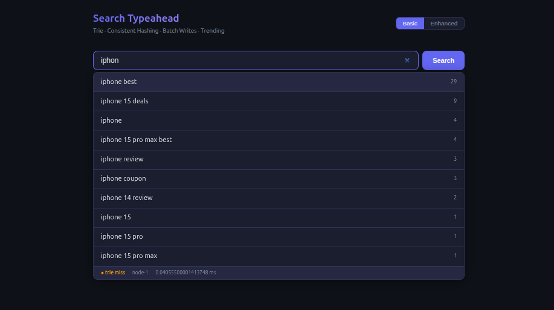
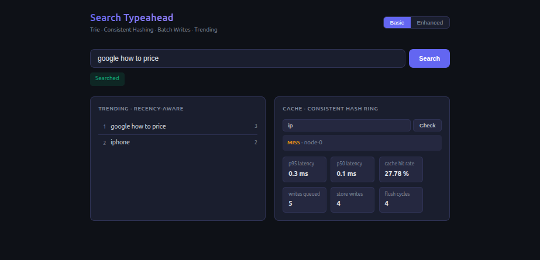
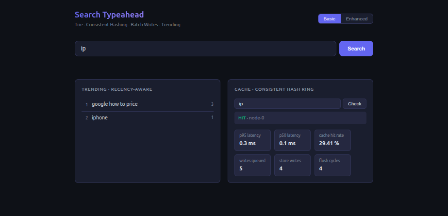
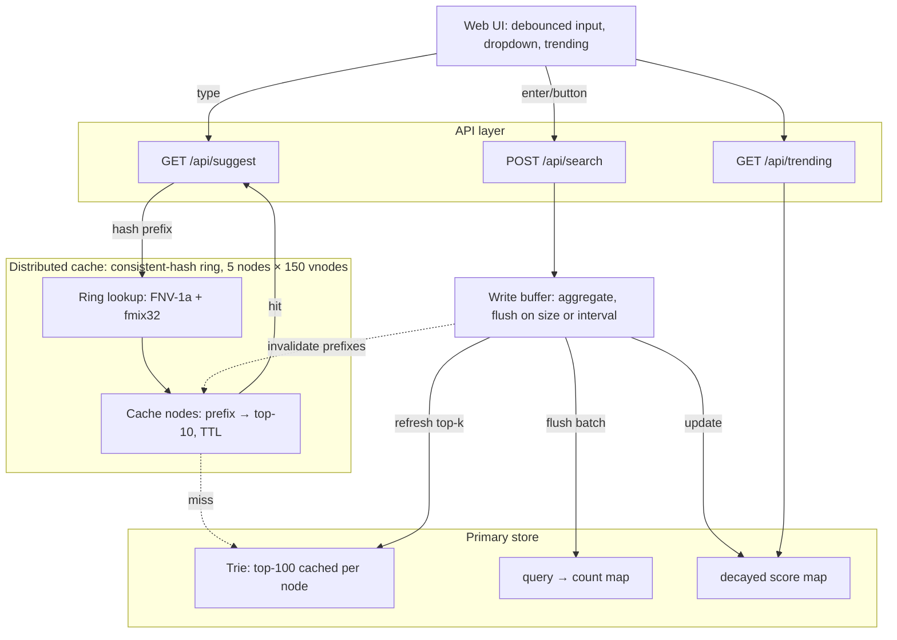

# Search Typeahead System

A low-latency search typeahead service built to demonstrate backend data-system design: prefix suggestions via a trie with cached top-k, a distributed cache partitioned by a self-implemented consistent-hash ring, recency-aware trending via exponential time decay, and batched writes that absorb search-count update pressure. Next.js + TypeScript, runs locally with one command.

Design rationale, rejected alternatives, and trade-offs for every component: [PRD_search_typeahead.md](./PRD_search_typeahead.md)
Measured performance: [PERFORMANCE.md](./PERFORMANCE.md)

---

## Demo

**Suggestion dropdown (basic mode) — trie miss, node-1 routed, 0.04 ms**


**Cache miss before first suggestion request**


**Cache hit after suggestion request populates node**


---

## Architecture



Three layers:

- **Cache layer.** Five logical cache nodes, each holding `prefix → top-10 suggestions` with a TTL. Ownership is decided by a consistent-hash ring with 150 virtual nodes per physical node, using FNV-1a passed through a MurmurHash3 fmix32 finalizer for uniform placement. The suggestion read path checks this layer first.
- **Primary store.** A `query → count` map plus a trie where each node caches its top-100 completions by count. Queried only on a cache miss.
- **Write path.** Submissions land in an in-memory buffer, are aggregated (N searches for the same query become one +N write), and flush to the store on a size threshold or a time interval, whichever fires first.

---

## Setup

Requires Node 18.17+.

```bash
npm install
npm run build
npm start
# open http://localhost:3000
```

Development: `npm run dev`

---

## Dataset

214,816 unique queries generated in `src/lib/dataset.ts` via combinatorial cross-products of brand, product, qualifier, tech, and place terms. Counts follow a Zipfian distribution (α = 0.9): a handful of queries carry very high counts, ~92% sit at count 1. No external file required.

To use a real dataset, create `data/queries.tsv` (`query<TAB>count`, one per line) and replace `generateDataset()`:

```ts
import fs from 'fs';
export function generateDataset(): QueryEntry[] {
  return fs.readFileSync('data/queries.tsv', 'utf8')
    .split('\n').filter(Boolean)
    .map(line => { const [query, c] = line.split('\t'); return { query, count: parseInt(c, 10) }; });
}
```

---

## API

| Endpoint | Request | Response |
|---|---|---|
| `GET /api/suggest?q=<prefix>&mode=basic\|enhanced` | prefix, optional mode | `{ suggestions: [{query, count}], _debug: {source, node, latencyMs} }` |
| `POST /api/search` | `{ query }` | `{ message: "Searched" }` |
| `GET /api/cache/debug?prefix=<prefix>` | prefix | `{ node, status: "hit"\|"miss" }` |
| `GET /api/trending?n=<n>` | optional n | `{ trending: [{query, count}] }` |
| `GET /api/metrics` | none | `{ latency, cache, writeBuffer, store, ring }` |

`mode=basic` ranks by all-time count, served from the cache. `mode=enhanced` re-ranks a top-100 candidate pool by exponential time-decayed score, computed fresh per request, never cached. The two modes share no cache entries.

---

## Scripts

```bash
npm run loadtest   # skewed traffic mix, prints client + server latency, cache hit rate, write reduction
npm run ringdist   # routes full key space through ring, prints per-node load and imbalance ratio
```

Both require the server to be running first.

---

## Key design decisions

Full treatment with alternatives and trade-offs in [PRD_search_typeahead.md](./PRD_search_typeahead.md).

- **Trie with cached top-k.** Prefix lookup is O(prefix length), independent of dataset size. Top-100 per node (not 10) so enhanced mode has a wide enough candidate pool to surface recently-surging queries.
- **Consistent hashing with virtual nodes.** Adding or removing a node remaps ~1/N keys. FNV-1a alone clustered vnode ring positions (2.04x imbalance); adding fmix32 fixed it to 1.097x, matching theory for 150 vnodes.
- **Enhanced mode cache bypass.** Basic and enhanced share no cache entries by design; enhanced always computes fresh so a basic-ordered cache entry cannot contaminate recency-aware results.
- **Batched writes.** Decouples write throughput from search rate. 75.8% write reduction measured at load. Unflushed counts are lost on crash: accepted durability-for-throughput trade-off.
